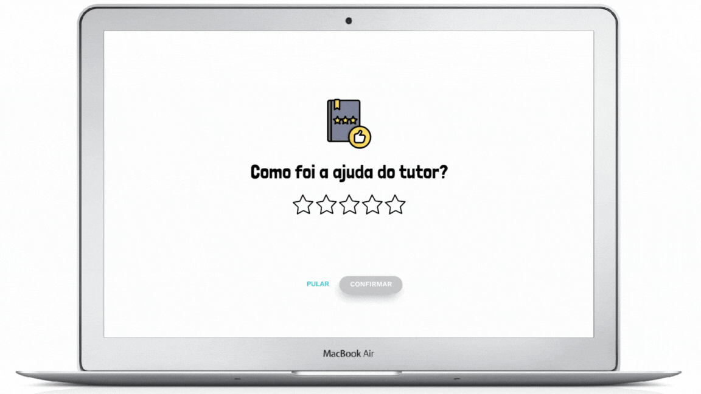
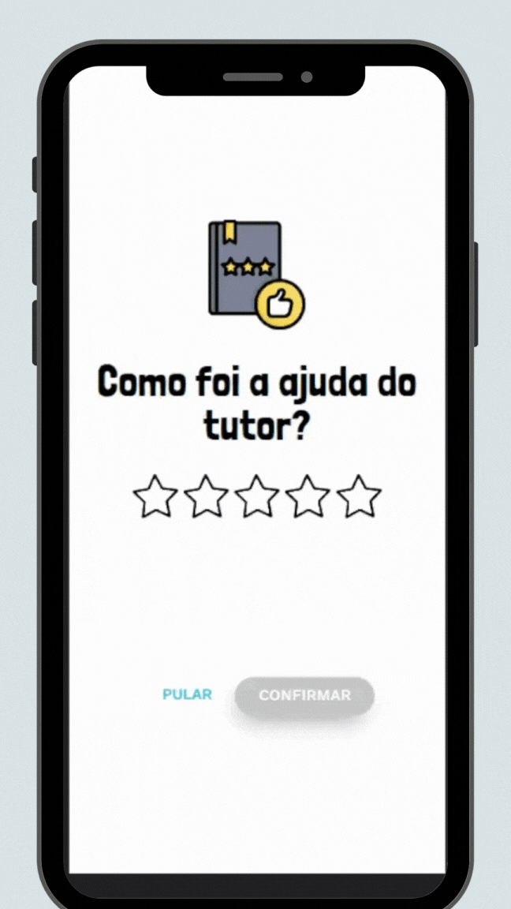

<h1 align="center">
    <strong>Desafio Tutor Mundi</strong>
</h1>

<p align="center">
    <apan align="center">
      
    </apan>
        <span align="center">
      
    </span>
</p>


## 🧪 Tecnologias

Esse projeto foi desenvolvido com as seguintes tecnologias:

- [HTML](https://developer.mozilla.org/pt-BR/docs/Web/HTML)
- [CSS](https://developer.mozilla.org/pt-BR/docs/Web/CSS)
- [JavaScript](https://developer.mozilla.org/pt-BR/docs/Web/JavaScript)

## 🚀 Como executar

Clone o projeto e acesse a pasta do mesmo.

```bash
$ git clone https://github.com/erikbernard/desafio-tutor-mundi.git
$ cd desafio-tutor-mundi
```

Para iniciá-lo, siga os passos abaixo:

```bash
# abra em um browser o arquivo index.html
```


## 💻 Projeto

Projeto desenvolvido durante o processo seletivo da [TuTor Mundi](https://tutormundi.com/), a crição de uma pagina de  avaliação da satisfação.


## 🔖 Layout

Você pode visualizar o layout do projeto através do link abaixo:

- [Layout Web](https://www.figma.com/file/wzRh8n0Ju8tZO2mjtv8A6b/Developer-test-(Copy)?node-id=303%3A189&t=QwJF000BxjepJq2n-1)

Lembrando que você precisa ter uma conta no [Figma](http://figma.com/).
## 📝 License

Esse projeto está sob a licença MIT. Veja o arquivo [LICENSE](LICENSE) para mais detalhes.